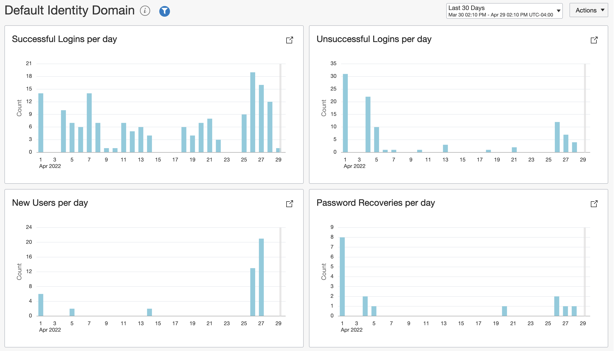
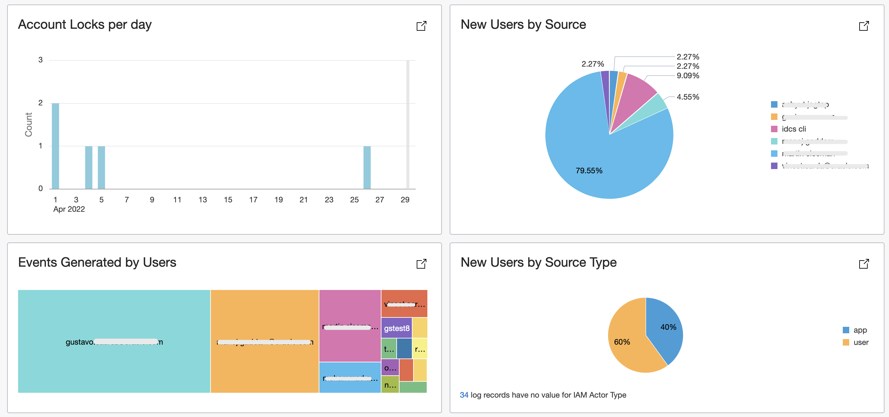
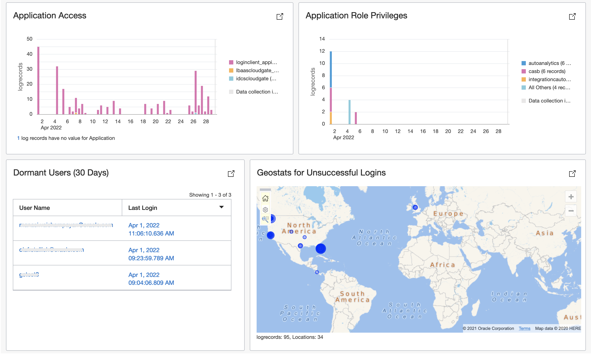

# oci-iam-dashboard

This repository provides an OCI Logging Analytics Dashboard with some sample widgets to monitor and visualize audit Events for OCI IAM Identity Domains.  The Dashboard will only work in OCI Tenancies that [support IAM Identity Domains](https://docs.oracle.com/en-us/iaas/Content/Identity/getstarted/identity-domains.htm#identity_documentation__updated-identity-domains).  

## Table of Contents

## Overview

The Audit Logs for OCI IAM Identity Domains can be searched directly from the OCI Audit Service along with the events from other OCI Services.  The IDCS Rest APIs can still be used, but the Audit Service is more convenient since Audit logs can be easily pushed to Streaming, Object Storage, etc.  The solution in this repository deploys SCH to send OCI Audit Logs to Logging Analytics.  It also deploys a Dashboard to visualize the logs related to OCI Identity Domains.

## Resources

The following resources are provisioned with terraform or Resource Manager

- **Logging Analytics**: This is a regional service.  It will be onboarded in the selected region if not available yet.  This can incur  some storage costs.
- **Custom Logging Analytics Fields**: Some custom fields are provisioned in Logging Analytics to support parsing and querying of the OCI Audit Logs.  The fields include: IAM Domain Name, IAM Event ID, IAM Actor Name, IAM Actor Type, IAM Target Name, IAM CLIENT IP, IAM Identity Provider, etc.
- **Custom Logging Analytics Parser**: The parser *IAM Audit Log Format* is used to parse the additionalDetails field from the OCI Audit Logs for Identity Audit Logs.
- **OCI Audit Logs Source**:  The OOB source *OCI Audit Logs* is modified to include the above parser.
- **Loggin Analytics Log Group**: A Log Group named *iam_identity_domain_audit_${var.iam_dashboard_domainname}* is provisioned as the target for Service Connector Hub.
- **Service Connector Hub**: A SCH named *IAM Identity Domain Audit to Logging Analytics* is provisioned to push OCI Audit Logs for a specific compartment.
- **IAM Policy**: A Policy named *IAM_Dashboard_ConnectorPolicy_LoggingAnalytics_${var.iam_dashboard_domainname}* that allows SCH to publish logs to the above Log Group.

- **IAM Dashboard**:

